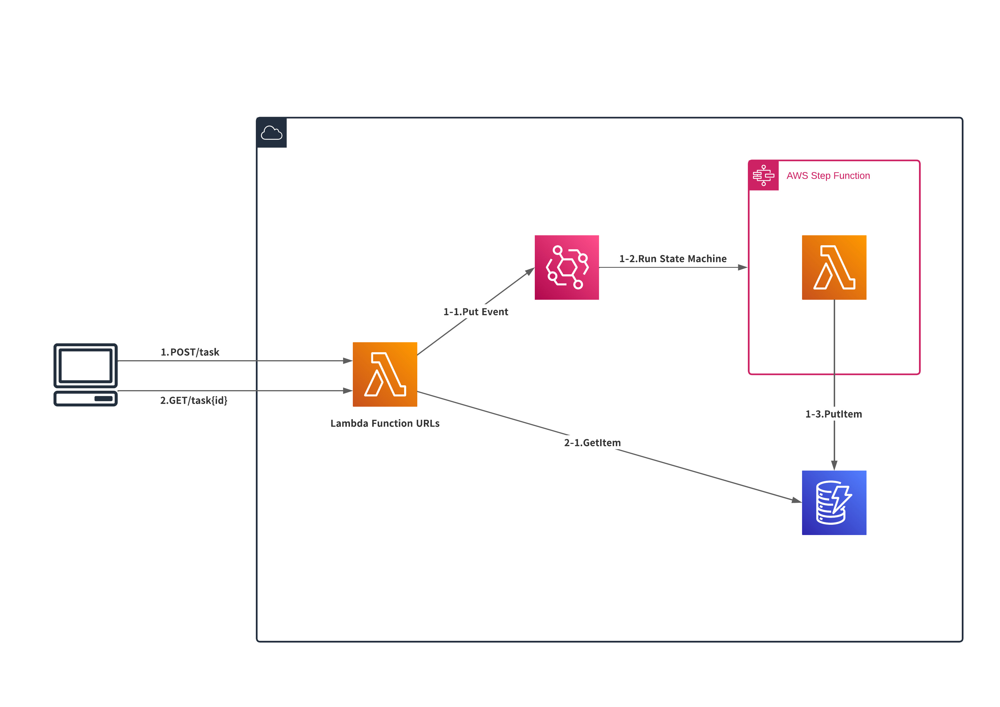

# OverView

EventBridge to StepFunctions Example



# Usage

```
$ cdk --version
2.65.0 
```

# Run

```
$ curl -X POST \
  -H "Content-Type: application/json" \
  -H "x-project-id: hoge" \
  -d '{"message" : "fega"}' \
   {Lambda Function URLs}/task | jq

$ curl -X GET \
  -H "Content-Type: application/json" \
  -H "x-project-id: hoge" \
   {Lambda Function URLs}/task/{id}} | jq
```